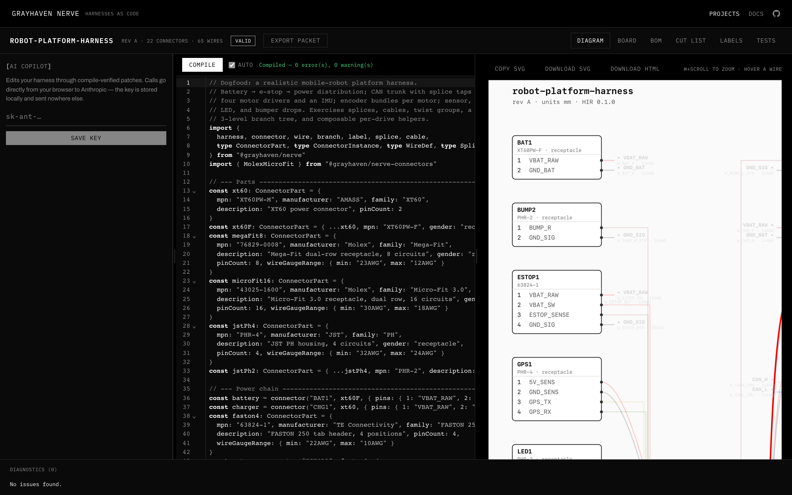
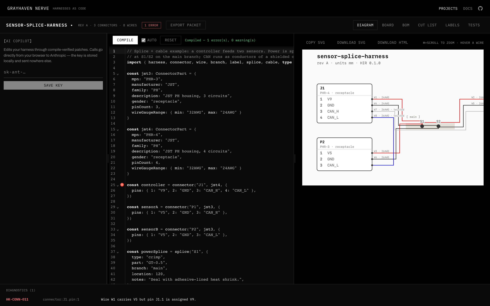
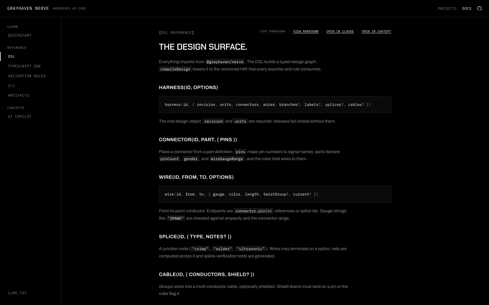

# Grayhaven Nerve

**Harnesses as code for machines that need a nervous system.**

[](https://github.com/tylergibbs1/nerve/actions/workflows/ci.yml)
[](https://www.npmjs.com/package/@grayhaven/nerve)
[](./LICENSE)

Nerve turns wiring-harness design into a version-controlled, type-safe workflow:

```
TypeScript DSL → compiler → HIR → 17 validation rules → deterministic rendering → manufacturing packet → test artifacts
```

**Try it now: [nerve-demo.vercel.app](https://nerve-demo.vercel.app)** — editor, docs, and three example harnesses, no install.

[](https://nerve-demo.vercel.app/projects/robot-platform/diagram)

## Why

A wiring harness is a program your machine runs on copper. Today it lives in PDFs and tribal knowledge. Nerve makes it source code: diffable in review, validated in CI, rendered into byte-identical manufacturing artifacts every time. The renderer never owns truth — every line in every output traces back to a design object you can `git blame`.

## What you get

- **A typed DSL** — `harness` / `connector` / `wire` / `splice` / `cable` / `branch` / `label` / `variant`, compiled to a versioned intermediate representation (HIR)
- **17 validation rules with stable `HK-*` codes** — missing ground returns, untwisted differential pairs (CAN/RS-485/USB, bus-indexed), ampacity vs. gauge, pin/signal mismatches, unlabeled branches… each one a potential field failure caught at compile time
- **Deterministic artifacts** — schematic + harness-board SVGs, BOM / cut-list / label / test-plan CSVs, assembly instructions, a PDF manufacturing packet, and a zip that hashes identically for identical inputs
- **An interactive web workspace** — compile-on-type in a Web Worker, schematics with net hover-highlighting and zoom, lint gutters that point at the offending wire, full packet export from the browser, and a self-contained interactive HTML viewer you can email to the shop floor
- **An AI copilot** — describe the change; edits land only after they compile and pass the rules (bring your own Anthropic key)
- **Agent-ready docs** — [`/llms.txt`](https://nerve-demo.vercel.app/llms.txt), per-page markdown mirrors, copy-as-markdown everywhere

The editor catches the classic mistake — a wire carrying `V5` landing on a pin assigned `V9` — as you type:

[](https://nerve-demo.vercel.app/projects/sensor-splice/diagram)

## Quick start

```bash
npm install @grayhaven/nerve @grayhaven/nerve-connectors @grayhaven/nerve-cli

npx --package=@grayhaven/nerve-cli nerve init .
npx --package=@grayhaven/nerve-cli nerve compile ./src/main.harness.ts
npx --package=@grayhaven/nerve-cli nerve export  ./src/main.harness.ts
# dist/ → harness.json, schematic.svg + .html, board.svg, BOM/cut-list/label/test CSVs,
#         assembly instructions, manufacturing-packet.pdf + .zip
```

```ts
import { harness, connector, wire } from "@grayhaven/nerve"
import { MolexMicroFit } from "@grayhaven/nerve-connectors"

const j1 = connector("J1", MolexMicroFit["43025-0800"], {
  pins: { 1: "VBAT_24V", 2: "GND", 3: "CAN_H", 4: "CAN_L" },
})
// ...wires, branches, labels — see examples/motor-controller
```

Full guides: [quickstart](https://nerve-demo.vercel.app/docs) · [DSL reference](https://nerve-demo.vercel.app/docs/dsl) · [TypeScript SDK](https://nerve-demo.vercel.app/docs/sdk) · [rules](https://nerve-demo.vercel.app/docs/rules) · [CLI](https://nerve-demo.vercel.app/docs/cli) · [artifacts](https://nerve-demo.vercel.app/docs/artifacts) · [AI copilot](https://nerve-demo.vercel.app/docs/ai)

[](https://nerve-demo.vercel.app/docs/dsl)

## Packages (v0.3.0)

| Package | What it is |
| --- | --- |
| [`@grayhaven/nerve`](./packages/nerve) | Domain model, DSL, versioned HIR schema (Effect Schema), deterministic `compileDesign`, diagnostics + `rule()` API, `diffHir`, `defineConfig` |
| [`@grayhaven/nerve-rules`](./packages/nerve-rules) | 17 built-in validation rules with stable `HK-*` codes + a derived numeric code mapping for tooling |
| [`@grayhaven/nerve-compiler`](./packages/nerve-compiler) | `.harness.ts` loading, config discovery, Effect `CompilerService` + tagged errors, fail-closed gate |
| [`@grayhaven/nerve-exporters`](./packages/nerve-exporters) | DrawingIR → SVG/PDF/interactive HTML; branch-rail schematic layout with net labels; BOM / cut-list / label CSVs; continuity + splice + no-short test plan; byte-deterministic packet |
| [`@grayhaven/nerve-wireviz`](./packages/nerve-wireviz) | WireViz YAML import/export adapter with fixture corpus |
| [`@grayhaven/nerve-cli`](./packages/nerve-cli) | `nerve init/compile/validate/render/export/import/diff/inspect/quote/analyze/machine/contract/release/record/redline` — deterministic, CI-ready exit codes |
| [`@grayhaven/nerve-web`](./packages/nerve-web) | The web workspace: worker-sandboxed compile, interactive schematics, AI copilot, in-browser packet export, docs |
| [`@grayhaven/nerve-connectors`](./packages/nerve-connectors) | Verified connector library (Molex Micro-Fit 3.0 seed data) |
| [`examples/`](./examples) | Golden fixtures: motor-controller (PRD §9.1 verbatim) + variant, sensor-splice (splices/cables), robot-platform (22 connectors, 65 wires, 3-level branch tree) |

## Testing

Determinism is the product, so the suite tests it from every direction — **226 unit + 9 e2e tests**:

- **Property-based** (fast-check): ~2,000 generated designs per run; rules never throw, diagnostics stay canonical, metamorphic laws hold (adding a ground can only *remove* the missing-ground error)
- **Layout invariants**: the emitted SVG is parsed and checked spatially — every wire endpoint touches a pin or splice dot, nothing clips, rails are rails
- **Pixel visual regression**: schematics render to PNG headlessly and diff against committed baselines — visual changes become pictures in code review
- **Mutation testing** (Stryker, 87.6%): the suite is itself tested
- **Playwright e2e + axe**: real-browser flows (compile, lint gutter, clipboard, packet download) and WCAG serious/critical as release blockers
- **Golden corpus**: byte-identical artifact snapshots across every exporter

```bash
bun install
bun run test        # unit/property/layout/visual suites
bun run typecheck   # strict TS across all packages
bun run build       # dist builds for every package
cd packages/nerve-web && bun run e2e   # Playwright + axe (needs chromium)
bun run --filter @grayhaven/nerve-web dev   # web workspace
```

## Status

PRD implemented end to end (M0–M9 + the full expansion tier: Bill of Process, costing, component registry, shop-floor adapters, formboard tiling, engineering analysis, ECO/releases, build records, interface contracts, redlines, plugin SDK). See [`CHANGELOG.md`](./CHANGELOG.md) for release history, [`GOAL.md`](./GOAL.md) for current direction, and [`docs/prd.md`](./docs/prd.md) for the PRD.

**Live**: [nerve-demo.vercel.app](https://nerve-demo.vercel.app) ([nerve-site.vercel.app](https://nerve-site.vercel.app) aliases the same deployment). Licensed under Apache-2.0.
